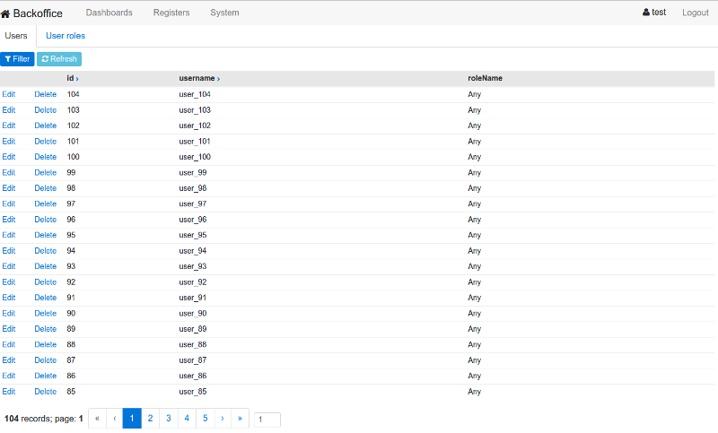

#Backoffice style web admin seed template project.

Based on **Angular2, Bootstrap4, SpringBoot with Rest Api**.  
Web application is based on  [Angular2-webpack-starter](https://github.com/AngularClass/angular2-webpack-starter) 

## Required software, build and launch steps:

1. java 8
2. postgres 9.4
3. Install NodeJS with NPM (node 5+ is requried),
   at least on Linux you'll also may need nodejs-devel.
4. create postgres test user and db with

	```bash 
	sudo su - postgres -c psql < support/create-test-user-db.sql
	```
5. build java server part first time

	```bash 
	./gradlew build   
	```
7. in admweb

	```bash 
	npm install 
	npm start  
	```
9. using intellij start BootApplicationLauncher
10. in browser navigate http://localhost:3000

There are still lot of todos to get more production ready:
like: global errors, improved filtering, Excel export, and more


## Screen shots

